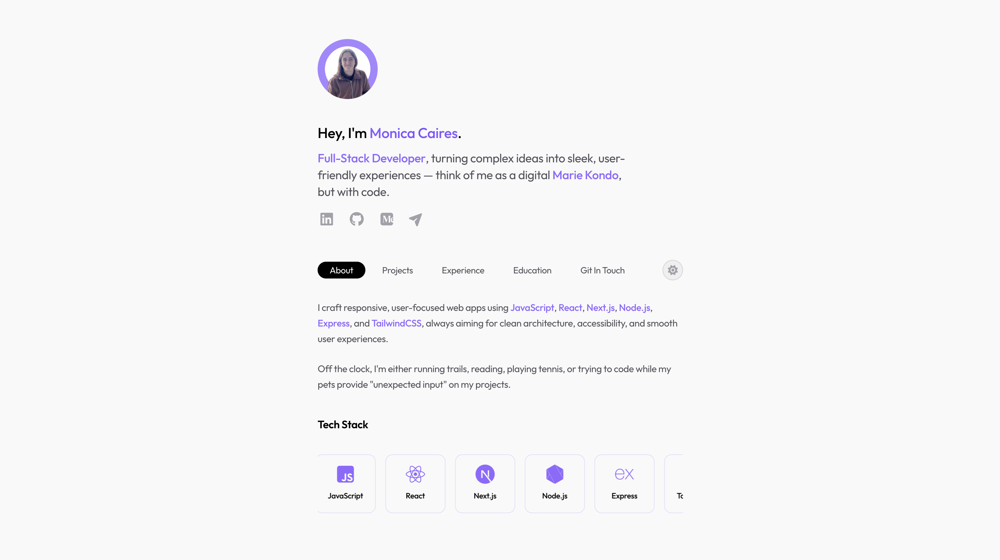

## 🎯 Overview

A modern, responsive portfolio website showcasing my work as a Full-Stack Developer. Built with a focus on clean architecture, accessibility, and user experience. It features a custom theme system, smooth animations, and a fully responsive design that works seamlessly across all devices.

## ✨ Features

- **Multi-Theme Support**: Four theme options (Light, Dark, Night Owl, High Contrast) with persistent user preferences.
- **Responsive Design**: Mobile-first approach with adaptive layouts for all screen sizes.
- **Smooth Animations**: CSS animations and transitions for enhanced user experience.
- **Accessibility**: Semantic HTML, ARIA labels, and keyboard navigation support.
- **Performance Optimized**: Lightweight, fast-loading with optimized assets.
- **Modern Stack**: Built with Vite, TailwindCSS v4, and vanilla JavaScript (ES6+).

## 🛠️ Tech Stack

- **HTML5**: Semantic markup for accessibility and SEO.
- **CSS3**: Custom properties, animations, and responsive design.
- **TailwindCSS v4**: Utility-first CSS framework for rapid UI development.
- **JavaScript (ES6+)**: Vanilla JS for interactivity and DOM manipulation.
- **Vite**: Fast build tool and development server.

## 🔗 Related Links

- **Live Site**: [Portfolio Website](https://monicacoding.dev)
- **GitHub**: [@monicacoding](https://github.com/monicacoding)
- **LinkedIn**: [monicafariacaires](https://www.linkedin.com/in/monicafariacaires/)
- **Email**: hello@monicacoding.dev

**Built with attention to detail and a passion for clean, user-friendly code.**
